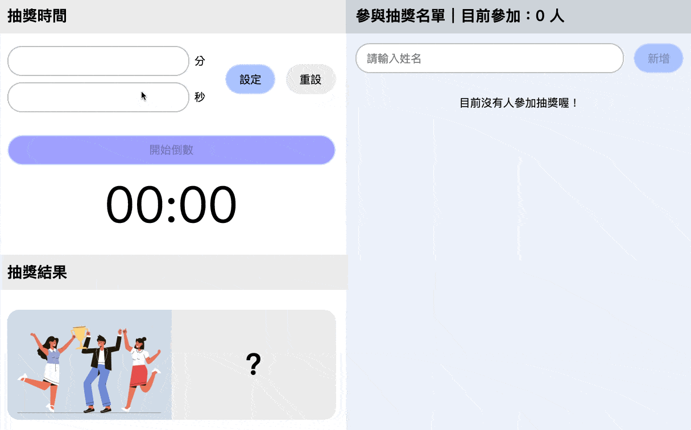

# Lucky-Draw

A simple lucky draw webapp built with React.js, Redux and styled-components.



## Installation

```shell
$ git clone https://github.com/cca923/Lucky-Draw.git
$ cd lucky-draw
$ npm install && npm start
```

## Features

### Countdown Timer

- Set/Reset countdown timer by entering minutes or seconds, then click "開始倒數" to get started.

### Participant List

- Easily manage list by entering/removing name.

### Responsive Web Design (RWD)

- Support Desktop version and Tablet version (900px as break point).
